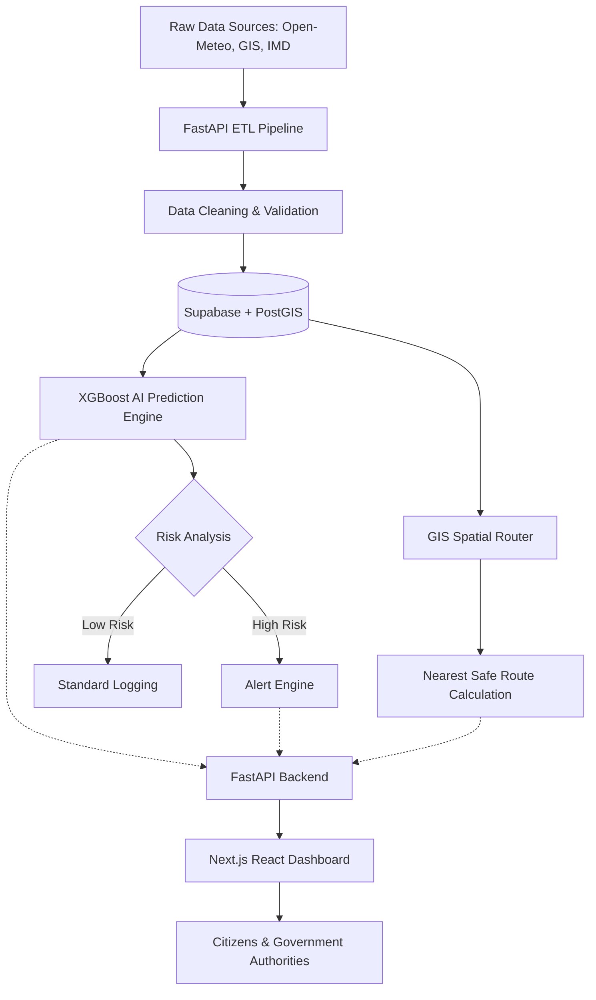

# FloodSense AI: Intelligent Flood Prediction & Early Warning System

FloodSense AI is a production-ready, AI-powered disaster management platform built specifically for Tamil Nadu. It seamlessly integrates real-time weather telemetry, GIS spatial analysis, and Artificial Intelligence to predict flood risks, generate dynamic evacuation routes, and surface early warnings.

---

## 🏗️ System Architecture



> **A Note on AI Architecture (GDNN vs XGBoost)**  
> While the original research concept proposes using *Knowledge Graphs and Graph Dynamic Neural Networks (GDNN)*, this production MVP implements an **XGBoost-based pipeline**. XGBoost is highly robust for tabular meteorological and hydrological features (Rainfall, Elevation, Humidity) and allows for extremely fast inference suitable for an MVP. The system's modular `app/ml` architecture leaves the door open to replace the XGBoost `.pkl` with a PyTorch GDNN model in future iterations.

---

## 🛠️ Technology Stack

- **Frontend**: Next.js (React 19), TailwindCSS, React Leaflet, Recharts, TanStack Query
- **Backend**: FastAPI, SQLAlchemy 2.0, Alembic, Pydantic, APScheduler
- **Database**: Supabase PostgreSQL with PostGIS extension
- **Machine Learning**: XGBoost, Scikit-learn, Pandas, SHAP (Explainability)
- **GIS Engine**: GeoPandas, GeoAlchemy2, Shapely

---

## 🚀 Deployment Guide

This project is configured for cloud deployment across Vercel (Frontend), Render (Backend), and Supabase (Database).

### 1. Database (Supabase)
- Create a new Supabase project.
- Open the SQL Editor and run: `CREATE EXTENSION postgis;`
- Copy your connection string into `backend/.env` (Ensure the password is URL encoded if it contains special characters).

### 2. Backend (Render)
- The backend contains a `Dockerfile` and `render.yaml`.
- Connect your GitHub repository to Render and deploy as a Docker web service.
- Add `DATABASE_URL` as an environment variable in the Render dashboard.

### 3. Frontend (Vercel)
- The frontend contains a `vercel.json` which proxies `/api/*` calls to your Render backend URL.
- Deploy the `frontend/` folder directly to Vercel.

---

## 📂 Project Structure

```text
floodsense-ai/
├── backend/
│   ├── app/
│   │   ├── api/          # FastAPI Routes (Predict, Spatial, ETL, Admin)
│   │   ├── etl/          # Automated extraction pipelines (Open-Meteo)
│   │   ├── ml/           # XGBoost training, feature engineering, SHAP
│   │   ├── models/       # SQLAlchemy ORM (Weather, River, Alerts, Predictions)
│   │   ├── scheduler/    # APScheduler for live ETL jobs
│   │   └── services/     # Core logic (Alert Engine, Inference)
│   ├── data/             # Organized GIS and Raw datasets
│   ├── scripts/          # DB Seeding, GIS Ingestion, Data Organizing
│   └── requirements.txt
├── frontend/
│   ├── src/
│   │   ├── app/          # Next.js App Router (Dashboard)
│   │   ├── components/   # React Components (Analytics, Map, Layout)
│   │   └── lib/          # Utilities
│   └── package.json
└── README.md
```

## 🔐 Admin Controls
To manually trigger background tasks without waiting for the 15-minute cron scheduler:
- **Run ETL**: `POST /api/v1/admin/etl/run`
- **Retrain AI Model**: `POST /api/v1/admin/ml/retrain`
