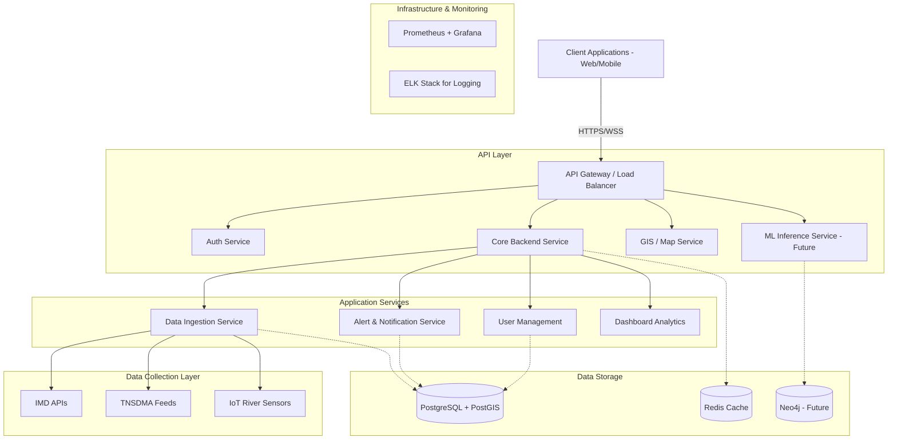
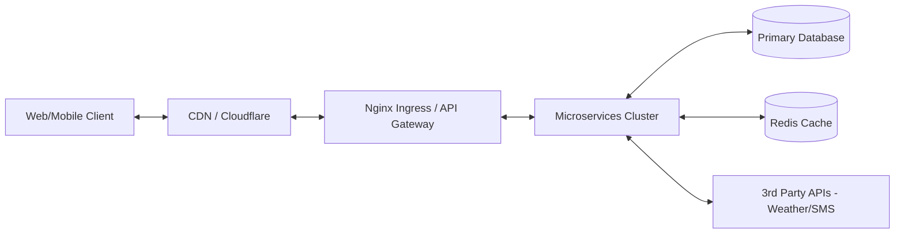
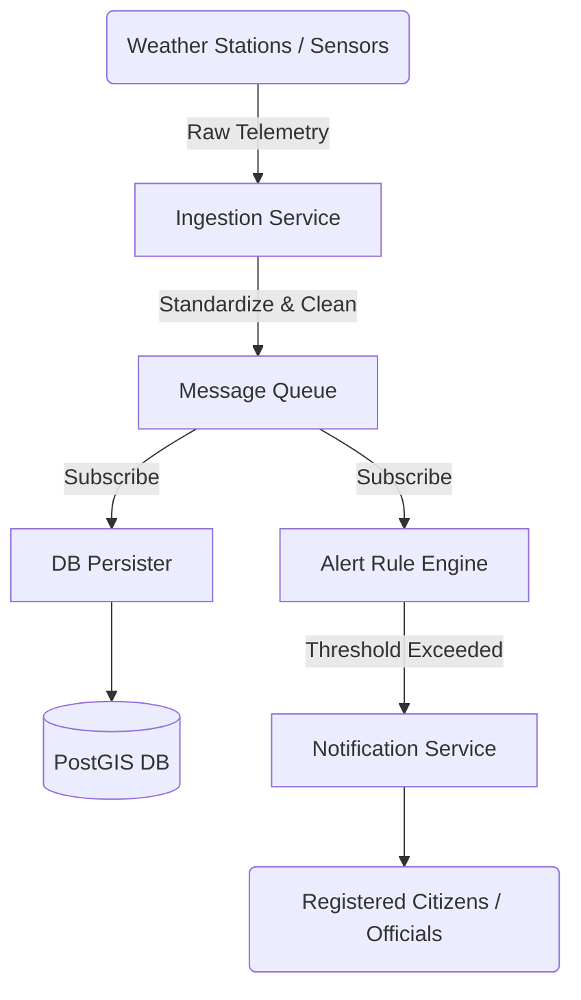
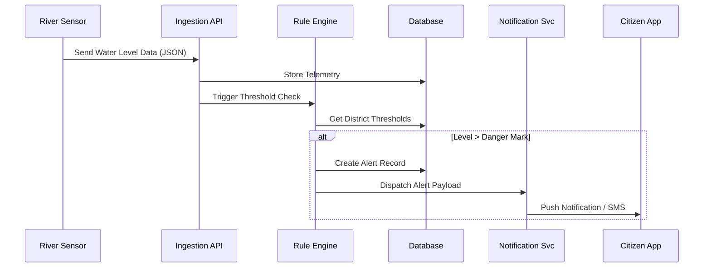

# FloodSense AI - Architecture & System Design

## 1. Enterprise Architecture Overview

The FloodSense AI platform is designed as a highly scalable, fault-tolerant, and secure microservices-based enterprise architecture to handle government-scale traffic, especially during disaster events.



## 2. Technology Stack & Rationale

### Frontend
- **Framework**: Next.js (React) - Selected for Server-Side Rendering (SSR) capabilities, crucial for SEO and fast initial load times during critical emergencies.
- **Styling**: Tailwind CSS - Rapid UI development with strict adherence to the design system.
- **Maps**: Mapbox GL JS / React Leaflet - WebGL powered rendering, essential for smooth handling of heavy GIS layers (flood plains, DEM).
- **Charts**: Recharts / Chart.js - For robust visualization of river levels and rainfall trends.

### Backend
- **Primary API**: Node.js with NestJS - Highly scalable, strongly typed (TypeScript), and enforces enterprise-grade modular architecture.
- **Data/ML API**: Python (FastAPI) - For future-proofing AI integrations and intensive GIS/array data processing.
- **Authentication**: Keycloak or Auth0 - OIDC compliant, RBAC-ready, secure identity management.

### Database
- **Relational & GIS**: PostgreSQL with PostGIS - The industry standard for combined relational data and advanced spatial queries (e.g., finding shelters within a 5km radius of a flood zone).
- **Caching**: Redis - In-memory caching for live weather and river telemetry to reduce DB load under spike traffic.

### Notification Service
- **Providers**: Twilio (SMS/WhatsApp), Firebase Cloud Messaging (FCM) for mobile push, SendGrid (Email).
- **Message Broker**: Apache Kafka or RabbitMQ - For reliable async message queuing during mass alert broadcasts.

### Deployment & DevOps
- **Containerization**: Docker & Kubernetes (EKS/GKE) - Auto-scaling during disaster events when traffic spikes unrecognizably.
- **CI/CD**: GitHub Actions - Automated testing, linting, and container registry pushing.
- **Monitoring**: Prometheus (Metrics) & Grafana (Dashboards).
- **Logging**: Elasticsearch, Logstash, Kibana (ELK) or Datadog.

## 3. High-Level Architecture (HLA)



## 4. Component Diagram

```mermaid
componentDiagram
    package "Frontend (Next.js)" {
        [Dashboard UI]
        [GIS Map Viewer]
        [Alert Dashboard]
    }
    
    package "Backend (NestJS)" {
        [Auth Controller]
        [GIS Controller]
        [Telemetry Processor]
        [Notification Engine]
    }
    
    package "Data Layer" {
        [PostgreSQL / PostGIS]
        [Redis Cache]
    }
    
    [Dashboard UI] --> [Auth Controller]
    [GIS Map Viewer] --> [GIS Controller]
    [Telemetry Processor] --> [PostgreSQL / PostGIS]
    [Notification Engine] --> [Redis Cache]
```

## 5. Deployment Diagram

```mermaid
graph TD
    subgraph AWS / Cloud Provider
        subgraph Public Subnet
            ALB[Application Load Balancer]
        end
        subgraph Private Subnet (Kubernetes EKS)
            UI[Frontend Pods]
            API[Backend Pods]
            Worker[Background Workers]
        end
        subgraph Data Subnet
            RDS[Amazon RDS Multi-AZ PostgreSQL]
            ElastiCache[ElastiCache Redis]
        end
    end
    Internet --> ALB
    ALB --> UI
    ALB --> API
    API --> RDS
    API --> ElastiCache
    Worker --> RDS
```

## 6. Data Flow Diagram



## 7. Sequence Diagram: Flood Alert



## 8. Data Sources (Tamil Nadu)

To function accurately, the system relies on the following Tamil Nadu specific datasets:

1. **Weather & Rainfall**: IMD (Indian Meteorological Department) API, TNSDMA AWS (Automatic Weather Stations). Download: IMD Pune portal.
2. **Digital Elevation Model (DEM)**: ISRO Bhuvan (Cartosat-1 30m DEM) or SRTM 30m for flood mapping and slope calculations. Download: Bhuvan / EarthExplorer.
3. **River/Catchment Geometries**: India WRIS (Water Resources Information System) - Cauvery, Vaigai, Thamirabarani basins.
4. **Historical Flood Data**: TNSDMA past disaster reports, Copernicus Emergency Management Service.
5. **District & Taluk Boundaries**: Survey of India / Tamil Nadu GIS portal (Shapefiles/GeoJSON).
6. **Population Density**: Census of India (gridded population data).
7. **Shelters & Hospitals**: Local government municipal data / OpenStreetMap (OSM) exports for TN.
8. **Road Networks**: OpenStreetMap (OSM) for routing and identifying flood-prone closures.

*Note: In Phase 1, sample subsets of these datasets will be mocked or manually ingested into PostGIS for foundational API and UI testing.*
