# Database Design (PostgreSQL + PostGIS)

## 1. Entity-Relationship (ER) Diagram

```mermaid
erDiagram
    Users ||--o{ Reports : submits
    Users ||--o{ AuditLogs : creates
    Districts ||--o{ Weather : has
    Districts ||--o{ Rainfall : has
    Districts ||--o{ RiverLevels : has
    Districts ||--o{ Shelters : contains
    Districts ||--o{ Hospitals : contains
    Districts ||--o{ ReliefCenters : contains
    Districts ||--o{ FloodPredictions : has
    Districts ||--o{ Alerts : has
    Alerts ||--o{ Notifications : generates

    Users {
        uuid id PK
        string name
        string email
        string phone
        string role "Citizen, Collector, Admin, Rescue"
        string password_hash
        timestamp created_at
    }

    Districts {
        int id PK
        string name
        geometry geom "PostGIS Polygon"
        float population
    }

    Weather {
        uuid id PK
        int district_id FK
        float temperature
        float humidity
        string status
        timestamp recorded_at
    }

    Rainfall {
        uuid id PK
        int district_id FK
        float mm_per_hour
        float mm_24h
        timestamp recorded_at
    }

    RiverLevels {
        uuid id PK
        int district_id FK
        string river_name
        string station_name
        float current_level
        float danger_level
        timestamp recorded_at
    }

    FloodPredictions {
        uuid id PK
        int district_id FK
        float risk_score
        string severity "Low, Medium, High, Severe"
        timestamp predicted_for
        timestamp generated_at
    }

    Alerts {
        uuid id PK
        int district_id FK
        string title
        text message
        string severity "Warning, Critical"
        boolean is_active
        timestamp issued_at
    }

    Shelters {
        uuid id PK
        int district_id FK
        string name
        geometry location "PostGIS Point"
        int capacity
        int current_occupancy
    }

    Hospitals {
        uuid id PK
        int district_id FK
        string name
        geometry location "PostGIS Point"
        boolean has_emergency
    }

    Reports {
        uuid id PK
        uuid user_id FK
        geometry location "PostGIS Point"
        string issue_type "Waterlogging, RoadBlock"
        text description
        string image_url
        timestamp reported_at
    }

    RoadClosures {
        uuid id PK
        int district_id FK
        string road_name
        geometry location "LineString"
        timestamp closed_at
    }

    ReliefCenters {
        uuid id PK
        int district_id FK
        string name
        geometry location "PostGIS Point"
        string resources_available
    }

    Notifications {
        uuid id PK
        uuid alert_id FK
        string channel "SMS, Push, Email"
        string status "Sent, Failed"
        timestamp sent_at
    }

    AuditLogs {
        uuid id PK
        uuid user_id FK
        string action
        string entity
        timestamp created_at
    }
```

## 2. Normalization Strategy

The database schema is designed conforming to **3rd Normal Form (3NF)**:
- **1NF (First Normal Form)**: All tables have a primary key (UUID or Integer). All attributes contain atomic values. No repeating groups (e.g., resources are handled specifically, locations are native PostGIS geometries, not comma-separated lat/lng strings).
- **2NF (Second Normal Form)**: All tables are in 1NF and all non-key attributes are fully functional dependent on the primary key. For example, `district_name` is only present in `Districts`, and other tables reference it via `district_id`.
- **3NF (Third Normal Form)**: All tables are in 2NF and there are no transitive dependencies. For example, in `Alerts`, we do not store `district_name` alongside `district_id`. We only store `district_id`, preventing data anomalies on updates.

## 3. Spatial Indexes & Optimization
Due to the heavy GIS nature of this application, strict indexing rules are applied:
- `GIST` indexes will be applied to all `geometry` columns (e.g., `Shelters.location`, `Districts.geom`) to enable fast spatial queries (e.g., `ST_DWithin` to find nearby shelters, `ST_Contains` for point-in-polygon checks).
- `B-Tree` indexes on foreign keys (`district_id`, `user_id`) and chronological columns (`recorded_at`, `issued_at`) for optimized time-series data retrieval.
- Partitioning by time (e.g., monthly) on telemetry tables (`Weather`, `Rainfall`, `RiverLevels`) to ensure long-term scalability.
